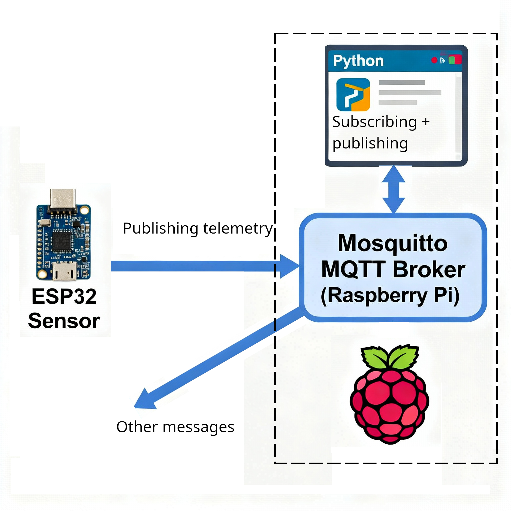
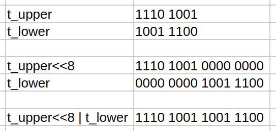
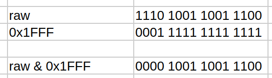
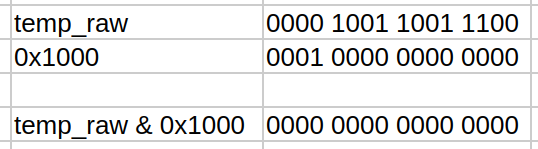

# LAB6: Telemetry with ESP32, MQTT, and Raspberry Pi

In this lab, we will create our first multiple-device IoT application.

You will need
- Raspberry Pi running Raspberry Pi desktop or a compatible linux-based OS
- ESP32 development board flashed with the MicroPython firmware

**System summary:**




Raspberry Pis are complete single-board computers with sufficient resources to run complex programs and services.
We will use a RPi to host a Mosquitto MQTT message broker service.
This message broker service will have the responsibility of receiving telemetry data from our ESP32 and forwarding this data to our Raspberry Pi Python applications, and more devices and programs in the future.

Our ESP32 development board will be set up as a temperature (and humidity?) telemetry device, sampling data from an I2C temperature (and humidity?) sensor and relaying this data over to our Mosquitto message broker.

Our Raspberry Pi will run a small Python program that will subscribe to the temperature (and humidity?) data, read it, process it, and respond with control messages over MQTT. 

## About Mosquitto

Mosquitto is a lightweight, open-source MQTT server (also called a "broker") that acts as the central messaging hub in an MQTT-based system. Mosquitto enables efficient communication between electronic devices—like sensors, microcontrollers, and computers—in Internet of Things (IoT) applications, industrial automation, and smart systems.

### MQTT Protocol Basics
Mosquitto implements the MQTT (Message Queuing Telemetry Transport) protocol, which uses a publish/subscribe model. Devices (known as "clients") can publish messages to named "topics," and other devices can subscribe to those topics to receive the messages. This approach allows for flexible, scalable data exchange without requiring devices to poll for updates, i.e., instead of having to constantly ask for updates, any new message is sent to the subscribers by the MQTT broker, who initiates the messaging. Messages are only sent when there is something to communicate, avoiding a message flooding from information requests.

### Why Mosquitto Is Useful
- **Lightweight**: Suitable for low-power embedded devices, such as microcontrollers, or full servers.
- **Real-Time Data**: Delivers sensor measurements or control commands instantly across a network.
- **Platform Support**: Runs on Linux, Windows, macOS, Raspberry Pi, and supports Docker deployment.
- **Offline Messaging**: Stores messages temporarily if the recipient is offline, then delivers them once reconnected—reducing data loss in unreliable networks.

### Electrical Engineering Applications
- Wireless sensor networks for environmental monitoring, industrial controls, or building automation, where hundreds of sensors need rapid, reliable communication.
- Connecting microcontrollers like ESP32, Arduino, or Raspberry Pi as MQTT clients to send data (e.g., temperature or voltage) to a central server for analysis.
- Enabling remote control and monitoring of systems, such as turning equipment on/off or reporting faults.

## Lab setup

**To ensure that communications will function as intended, it is important to connect all devices to the same WiFi network.**

This is because if all devices are connected to the same WiFi network, they then belong to the same broadcast domain and thus be able to message one-another.

**You must connect the Raspberry Pi to the class wireless network.**

## Part 1: Installing and configuring Mosquitto

### Step 1 : Install Mosquitto

On your Raspberry Pi, install Mosquitto and Mosquitto client tools as follows:

```bash
sudo apt update 
sudo apt install mosquitto mosquitto-clients
```

We verify that Mosquitto is running as a service by running a service status check as follows:
```bash
systemctl status mosquitto.service
```

The output should look something like this
```bash
● mosquitto.service - Mosquitto MQTT Broker
     Loaded: loaded (/usr/lib/systemd/system/mosquitto.service; enabled; preset: enabled)
     Active: active (running) since Thu 2025-10-02 04:37:44 EDT; 4h 25min ago
       Docs: man:mosquitto.conf(5)
             man:mosquitto(8)
   Main PID: 2184 (mosquitto)
      Tasks: 1 (limit: 28051)
     Memory: 1.8M (peak: 2.5M)
        CPU: 1.263s
     CGroup: /system.slice/mosquitto.service
             └─2184 /usr/sbin/mosquitto -c /etc/mosquitto/mosquitto.conf

Oct 02 04:37:44 ubuntu systemd[1]: Starting mosquitto.service - Mosquitto MQTT Broker...
Oct 02 04:37:44 ubuntu mosquitto[2184]: 1759394264: Loading config file /etc/mosquitto/conf.d/accept_external.co>
Oct 02 04:37:44 ubuntu systemd[1]: Started mosquitto.service - Mosquitto MQTT Broker.
```

Press `:` and then `q` to exit this view if you were not returned to the command prompt.

What you are looking for in this output are the words `active (running)` in green.

To test the functionality of the server, we also use the two client programs to publish messsages and to subscriibe to messages,

For this process, we need 2 terminal windows: one for the subscriber program and another for the publisher program.
So, in the first window, run the subscriber program, so that it can subscribe to the `room/temperature` topic and wait for published messages:
```bash
mosquitto_sub -t "room/temperature"
```

Then, open another terminal (CTRL+ALT+T) to enter the following publishing command:
```bash
mosquitto_pub -t "room/humidity" -m "33"
```

This should publish the message "33" under the `room/humidity` topic on the local MQTT server, our new Mosquitto service.
So you should see the mesage "33" aooear in the window with the subscriber application.


### Step 2: Configure Mosquitto to Accept External Connections

By default, mosquitto does not accept connection requests from external devices.
This is to allow you to install and test it without creating security breaches right away.

To enable communications between different devices, we must set up our Mosquitto server such that it can accept external connection requests.

To let mosquitto accept external connection requests, we add a configuration file in its configurations folder, as follows:

- Create and edit `accept_external.conf` in the configurations directory for mosquitto:

```bash
sudo nano /etc/mosquitto/conf.d/accept_external.conf
```
and add the following text

```conf
listener 1883 0.0.0.0
allow_anonymous true
```
... and finally press `CTRL+O` to output (save) the changes and `CTRL+X` to eXit.

To make these changes take effect we could reboot the system or just restart mosquitto.
To restart the mosquitto service, enter the following command in the terminal interface to the command prompt:
```bash
sudo systemctl restart mosquitto.service
```

Again, we verify that this all worked by running a status check as follows:
```bash
systemctl status mosquitto.service
```

The output should look something like this
```bash
● mosquitto.service - Mosquitto MQTT Broker
     Loaded: loaded (/usr/lib/systemd/system/mosquitto.service; enabled; preset: enabled)
     Active: active (running) since Thu 2025-10-02 09:33:44 EDT; 1min ago
       Docs: man:mosquitto.conf(5)
             man:mosquitto(8)
   Main PID: 2196 (mosquitto)
      Tasks: 1 (limit: 28051)
     Memory: 1.8M (peak: 2.5M)
        CPU: 1.263s
     CGroup: /system.slice/mosquitto.service
             └─2184 /usr/sbin/mosquitto -c /etc/mosquitto/mosquitto.conf

Oct 02 09:33:44 ubuntu systemd[1]: Starting mosquitto.service - Mosquitto MQTT Broker...
Oct 02 09:33:44 ubuntu mosquitto[2184]: 1759394264: Loading config file /etc/mosquitto/conf.d/accept_external.co>
Oct 02 09:33:44 ubuntu systemd[1]: Started mosquitto.service - Mosquitto MQTT Broker.
```

Press `:` and then `q` to exit this view if you were not returned to the command prompt.

What you are looking for in this output are the words `active (running)` in green.

We will be able to verify that communications between devices are functional by using 2 Raspberry Pi devices.

- In one RPi, run the `hostname` command to obtain the name of the host. For this example, let's imagine the hostname is `waldo`.
- In the other RPi, open a terminal and run `mosquitto_sub -h "waldo.local" -t "room/temperature"`
- In that same RPi, open a second terminal and run `mosquitto_pub -h "waldo.local" -t "room/temperature" -m "23"`
- You should see the new message appear in the first terminal window.

## Part 2: Programming an ESP32 to communicate MQTT messages

We will read sample data from an I2C sensor connected to one of our ESP32 dev board's I2C interfaces.
We will then convert this data to the correct units before publishing it, periodically, on the MQTT topic `room/temperature`.

### A. Setup

On your Raspberry Pi, open Thonny.
Connect your ESP32 to your Raspberry Pi via USB.
In Thonny, select the `MicroPython (ESP32)...` option at the bottom right corner of the Thonny application. This will interface with your ESP32 MicroPython environment.

### B. WiFi Connection

Create a new file and enter the following MicroPython code.

```python
import time
import network
#network is used to access the ESP32’s Wi-Fi interface in station mode, letting it join an existing network.

WIFI_SSID = "WiFi_SSID"
WIFI_PASS = "WiFi_password"

def wifi_connect():
    #Initializes the station interface with network.WLAN(network.STA_IF) and activates it.
    sta = network.WLAN(network.STA_IF)
    sta.active(True)
    #Initiates a connection with the credentials.
    sta.connect(WIFI_SSID, WIFI_PASS)
    #Pause the application until we know WiFi is connected
    while not sta.isconnected():
        print("connecting...")
        time.sleep(1)
    #Once connected, the network info is printed for reference
    print(f"WiFi connected {sta.ifconfig()}")
    return sta.isconnected()

def main():
    # Wi-Fi
    wifi_connect()

if __name__ == '__main__':
    main() 
```

This MicroPython code connects an ESP32 device to a Wi-Fi network using the provided SSID and password, looping until a successful connection is established.

Run this code to ensure that it completes successfully before trying anything else.

### C. I2C Interface

We will add the I2C connection component to the program.

**Setup:**
First verify which pins your ESP32 dev board uses for its I2C bus controllers. These pins should be labeled SDA and SCL for the data and clock lines, respectively, of the I2C bus. On most ESP32 boards, the default I2C pins are GPIO 21 for SDA and GPIO 22 for SCL.

Connect your own I2C sensor to the I2C bus controller by direct wire connection from SDA to SDA, SCL to SCL, VCC to VCC and GND to GND.
Pull-down resistors are normally integrated in the ESP32 development boards, so for small setups there is normally no need to add any.

**Code:**
Adding the I2C configuration portion to the preceding code, we add the operations of defining and configuring the I2C connection, as well as verifying the presence of the devices on the bus.

In the example below, the I2C sensor is an MCP9808, a popular and cheap temperature sensor with the base address `0x18`.

The number 0x18 is a hexadecimal number. Hexadecimal numbers are written using base 16, which means each digit can have sixteen possible values: 0–9 for the first ten values, followed by A–F to represent the decimal values 10 through 15. Hexadecimal notation is commonly used in computing and electronics because it is more compact than binary and easier to convert between systems—each hex digit corresponds directly to four binary digits (bits).
The number `0x18` therefore converts to `24` in devimal notation.

The new code will import the `machine` module to interface with the pins and I2C bus controller.
Define the pin numbers in the frontmatter section of the program - allowing all members of a programming team to see the defined values right at the top of the program.
Then, in the main method, we initialise the I2C bus controller interface object with the values
```python
i2c = I2C(0, scl=Pin(I2C_SCL), sda=Pin(I2C_SDA), freq=I2C_FREQ)
```
before scanning the bus and checking that the sensor is indeed connected.

```python
import time
import network
from machine import Pin, I2C

WIFI_SSID = "WiFi_SSID"
WIFI_PASS = "WiFi_password"

# I2C config — adjust pins as wired
I2C_SCL = 22
I2C_SDA = 21
I2C_FREQ = 100000

# MCP9808 constants
MCP9808_ADDR = 0x18

def wifi_connect():
    #Initializes the station interface with network.WLAN(network.STA_IF) and activates it.
    sta = network.WLAN(network.STA_IF)
    sta.active(True)
    #Initiates a connection with the credentials.
    sta.connect(WIFI_SSID, WIFI_PASS)
    #Pause the application until we know WiFi is connected
    while not sta.isconnected():
        print("connecting...")
        time.sleep(1)
    #Once connected, the network info is printed for reference
    print(f"WiFi connected {sta.ifconfig()}")
    return sta.isconnected()

def main():
    # Initialise the I2C bus on the connected pins
    i2c = I2C(0, scl=Pin(I2C_SCL), sda=Pin(I2C_SDA), freq=I2C_FREQ)
    
    # scan and verify presence
    found = i2c.scan()
    if MCP9808_ADDR not in found:
        print("Warning: MCP9808 not found on bus; scan:", [hex(a) for a in found])

    # Wi-Fi
    wifi_connect()


if __name__ == '__main__':
    main() 
```

**D. Acquiring I2C data**


```python
import time
import network
from machine import Pin, I2C

WIFI_SSID = "WiFi_SSID"
WIFI_PASS = "WiFi_password"

# I2C config — adjust pins as wired
I2C_SCL = 22
I2C_SDA = 21
I2C_FREQ = 100000

# MCP9808 constants
MCP9808_ADDR = 0x18
# MCP9808 registers (datasheet, temp register 0x05: 13-bit, sign and flags in upper bits)
REG_AMBIENT_TEMP = 0x05

def wifi_connect():
    #Initializes the station interface with network.WLAN(network.STA_IF) and activates it.
    sta = network.WLAN(network.STA_IF)
    sta.active(True)
    #Initiates a connection with the credentials.
    sta.connect(WIFI_SSID, WIFI_PASS)
    #Pause the application until we know WiFi is connected
    while not sta.isconnected():
        print("connecting...")
        time.sleep(1)
    #Once connected, the network info is printed for reference
    print(f"WiFi connected {sta.ifconfig()}")
    return sta.isconnected()

def mcp9808_read_c(i2c):
    # Read two bytes from ambient temperature register
    data = i2c.readfrom_mem(MCP9808_ADDR, REG_AMBIENT_TEMP, 2)
    t_upper = data[0]
    t_lower = data[1]
    # Combine the two bytes into one number
    raw = (t_upper << 8) | t_lower
    # Per MCP9808: bits 15..13 are flags (Tcrit/Tupper/Tlower), bits 12..0 are temperature
    # Mask the upper 3 bits that are not numerical
    temp_raw = raw & 0x1FFF  # 13-bit temperature
    # Sign bit is bit 12; if set, temperature is negative (two's complement for 13 bits)
    if temp_raw & 0x1000: #use a bitwise operation to see if there is a match
        temp_raw -= 1 << 13
    # Resolution is 0.0625°C per LSB
    celsius = temp_raw * 0.0625
    return celsius


def main():
    # Initialise the I2C bus on the connected pins
    i2c = I2C(0, scl=Pin(I2C_SCL), sda=Pin(I2C_SDA), freq=I2C_FREQ)
    
    # scan and verify presence
    found = i2c.scan()
    if MCP9808_ADDR not in found:
        print("Warning: MCP9808 not found on bus; scan:", [hex(a) for a in found])

    # Wi-Fi
    wifi_connect()

    while True:
        try:
            t = 1000
            t = mcp9808_read_c(i2c)
        except:
            print("i2c read error")
        print(f"Temperature : {('%.2f' % t).encode()}")
        time.sleep(5)  # publish interval seconds

if __name__ == '__main__':
    main() 
```

**Bit-wise operations**

Above we have a few operations that are manipulating values bit by bit. These are normally called **bit-wise** operations.

Here are the explanations of each, with diagrams.
- In the first few lines of the MCP9808 data acquisition function, 2 bytes are read into an array, then placed into 2 variables, and then assembled into a 2-byte "number"
    -`data = i2c.readfrom_mem(MCP9808_ADDR, REG_AMBIENT_TEMP, 2)` reads 2 bytes into the `data` array
    - `t_upper = data[0]` and `t_lower = data[1]` assigns 2 new variables
    - `raw = (t_upper << 8) | t_lower` has 2 operations going on:
        - `(t_upper << 8)` moves the bits from the `t_upper` variable 8 positions to the left... effectiely making these the most significant bits
        - then the bit-wise OR operator `|` assembles the higher and lower bits into a single value which will be stored in the `raw` variable
        
    - `temp_raw = raw & 0x1FFF` uses the bit-wise AND to remove non-numerical bits from the data, as per the datasheet information. If you AND anything with 0, you get 0. Done bit-by-bit, we can cancel out, or mask, specific bits.
    
    - with the same bitwise AND, we can check that a single bit, the twelfth in this case is set to `1` in the instructions
    `temp_raw & 0x1000`
    
    Because the number is 0, we know that this is false. It the result were non-zero,it would be true.
    - the operation `temp_raw -= 1 << 13` happens if the 12th bit marked the number as negative. In this case, the special [Twos complement](https://en.wikipedia.org/wiki/Two%27s_complement) operation is often used to encode negative numbers. This provides the benefit of being able to store an extra number representation than you would if you just considered the bit to mean the same for positive and negative numbers.  
    - The final operation, `celsius = temp_raw * 0.0625`, is just scaling by a factor. Each unit of raw temperature is worth `0.0625` degrees celcius, for this sensor.

**E. Sending MQTT Messages**

We use the `umqtt.simple` library, dedicated to MQTT communication, to ensure that we send compatible messages and respect the protocol.
From this library, we will use the `MQTTClient` class to interface with MQTT services.

The MQTT settings will include the the MQTT broker hostname or IP address, the service port (which is 1883 by default), a spacial name to identify our ESP32, a keepalive time that is used so the client sends a message to the server in the absence of other trafic in a specified time lapse. This keepalive may impact on reporting that sensors have come offline, etc.

Other setup include the topic(s) where data will be published.

The MQTT communication will occur in the `main()` method and will consist of
- creation of the client object using the parameters
- connection to the MQTT server
- periodic polling of the sensor data and publishing to the chosen topic.

Notice that many levels of try..except structures are present to handle any exceptions that may occur:
- If the connection to the MQTT broker fails, the program will exit, making sure to always disconnect, if connected.
- If the sensor becomes unavailable, then publising stops, until it comes back online
- If publishing fails, a new connection is attempted.

```python
import time
import network
from machine import Pin, I2C
from umqtt.simple import MQTTClient  # use umqtt.robust if desired

WIFI_SSID = "WiFi_SSID"
WIFI_PASS = "WiFi_password"

# MQTT settings
MQTT_BROKER = "waldo.local"
MQTT_PORT = 1883
MQTT_CLIENT_ID = "esp32-room-sensor"
MQTT_KEEPALIVE = 60  # seconds
TOPIC_TEMP = b"room/temperature"

# I2C config — adjust pins as wired
I2C_SCL = 22
I2C_SDA = 21
I2C_FREQ = 100000

# MCP9808 constants
MCP9808_ADDR = 0x18
# MCP9808 registers (datasheet, temp register 0x05: 13-bit, sign and flags in upper bits)
REG_AMBIENT_TEMP = 0x05

def wifi_connect():
    sta = network.WLAN(network.STA_IF)
    sta.active(True)
    sta.connect(WIFI_SSID, WIFI_PASS)
    while not sta.isconnected():
        print("connecting...")
        time.sleep(0.2)
    print(f"WiFi connected {sta.ifconfig()}")
    return sta.isconnected()

def mcp9808_read_c(i2c):
    # Read two bytes from ambient temperature register
    data = i2c.readfrom_mem(MCP9808_ADDR, REG_AMBIENT_TEMP, 2)
    t_upper = data[0]
    t_lower = data[1]
    # Combine
    raw = (t_upper << 8) | t_lower
    # Per MCP9808: bits 15..13 are flags (Tcrit/Tupper/Tlower), bits 12..0 are temperature
    temp_raw = raw & 0x1FFF  # 13-bit temperature
    # Sign bit is bit 12; if set, temperature is negative (two's complement for 13 bits)
    if temp_raw & 0x1000:
        temp_raw -= 1 << 13
    # Resolution is 0.0625°C per LSB
    celsius = temp_raw * 0.0625
    return celsius

def main():
    # I2C
    i2c = I2C(0, scl=Pin(I2C_SCL), sda=Pin(I2C_SDA), freq=I2C_FREQ)
    
    # Optional: scan and verify presence
    found = i2c.scan()
    if MCP9808_ADDR not in found:
        print("Warning: MCP9808 not found on bus; scan:", [hex(a) for a in found])

    # Wi-Fi
    wifi_connect()

    # MQTT
    mqtt = MQTTClient(MQTT_CLIENT_ID, MQTT_BROKER, MQTT_PORT, keepalive=MQTT_KEEPALIVE)
    try:
        mqtt.connect()
        while True:
            try:
                t = mcp9808_read_c(i2c)
                try:
                    print(f"Publishing {('%.2f' % t).encode()} to {TOPIC_TEMP}")
                    mqtt.publish(TOPIC_TEMP, ("%.2f" % t).encode())
                except Exception as e:
                    # try reconnect on publish error
                    print("Publishing error")
                    try:
                        mqtt.connect()
                    except:
                        pass
            except:
                print("i2c read error")
            time.sleep(5)  # publish interval seconds
    except Exception as e:
        print("MQTTClient connection failed");
        print(e)
    finally:
        try:
            mqtt.disconnect()
        except:
            pass

main()
```

Questions:
- Are you able to run this code on your ESP32 without error?
- What parameters do you need to adapt to your situation?
- How do you find the information needed for this customisation?
- Where woul you search for information if you were using a different sensor?
- How can you check that the data reaches your MQTT broker? Will you use mosquitto_pub or mosquitto_sub?

### Part 3: Raspberry Pi Python MQTT Subscriber

For devices with more resources, the `paho.mqtt` library is available.

Our final goal for this lab will be to leverage this library to build a simple program that connects to the MQTT server, subscribes to the topic of choice, and then receives/prints all the messages on this topic.

The program below is written in a few phases.

It is important to note that, since most of the processing happens in the library object functions, we only need to state what our program will do in specific cases.

Therefore, we
- define connection parameters
- define callback functions: the code that gets run when things happen
- instantiate the object
- connect the object to the callbacks
- call for the connection with the parameters
- start the event loop that will know when to call our callback functions.

This type of library manages much of what happens and is much simpler to use than the umqtt micropython library.

```python
import paho.mqtt.client as mqtt

#connection parameters
BROKER = "waldo.local"
PORT = 1883
TOPIC = "room/temperature"

#Event handlers (a.k.a. callback functions)
#what we do when the connection succeeds
def on_connect(client, userdata, flags, rc):
    print(f"Connected with result code {rc}")
    client.subscribe(TOPIC)

#what we do when a message arrives
def on_message(client, userdata, msg):
    print(f"Received on topic {msg.topic}: {msg.payload.decode()}")

#creation of client object
client = mqtt.Client()

#setting the event handlers - these are variables set to functions
client.on_connect = on_connect
client.on_message = on_message

#calling for the connection to occur
client.connect(BROKER, PORT, keepalive=60)

#starting the event loop without further processing
client.loop_forever()
#when we will also send messages, we will use client.loop() instead
```

Note that the used `paho.mqtt.client` class expects a few specific function names to work. This information comes from the [paho-mqtt client documentation found online](https://eclipse.dev/paho/files/paho.mqtt.python/html/client.html).

Can you run the program and receive the temperature sensor telemetry?

Is this program more equivalent to mosquitto_pub or mosquitto_sub?

## Conclusion

In this lab, a complete IoT telemetry loop was built using
- an ESP32 with MicroPython,
- an I2C temperature sensor,
- a Mosquitto MQTT broker running on a Raspberry Pi, and
- a Python MQTT subscriber on Raspberry Pi.

This setup showeded how sensors can sample environmental data, transmit it wirelessly using MQTT, and have it distributed, processed, or displayed by a computer.

You learned how to:
- Install and configure the Mosquitto MQTT broker on the Raspberry Pi for both local and external connection.
- Connect an ESP32 running MicroPython to a WiFi network, read temperature data from an I2C sensor, and publish it as MQTT messages to a designated topic.
- Subscribe to MQTT topics with a minimal Python program on the Raspberry Pi.

### Additional Notes & Recommendations

**Security note:**  
Anonymous external access to your MQTT broker is convenient for prototyping but is *not* recommended for *production environments*.

**Sensor expansion:**  
If you wish to use other I2C sensors, review their datasheets for register addresses, bit layouts, and conversion logic. Only the acquisition function and topic naming might differ.

**Troubleshooting tips:**  
If data is not received as expected:
- Double-check WiFi SSIDs and passwords on all devices.
- Ensure both Raspberry Pi and ESP32 can resolve the broker hostname (e.g., `waldo.local`)—try using direct IP addresses if needed.
- Confirm topic namings match exactly (MQTT topics are case-sensitive).