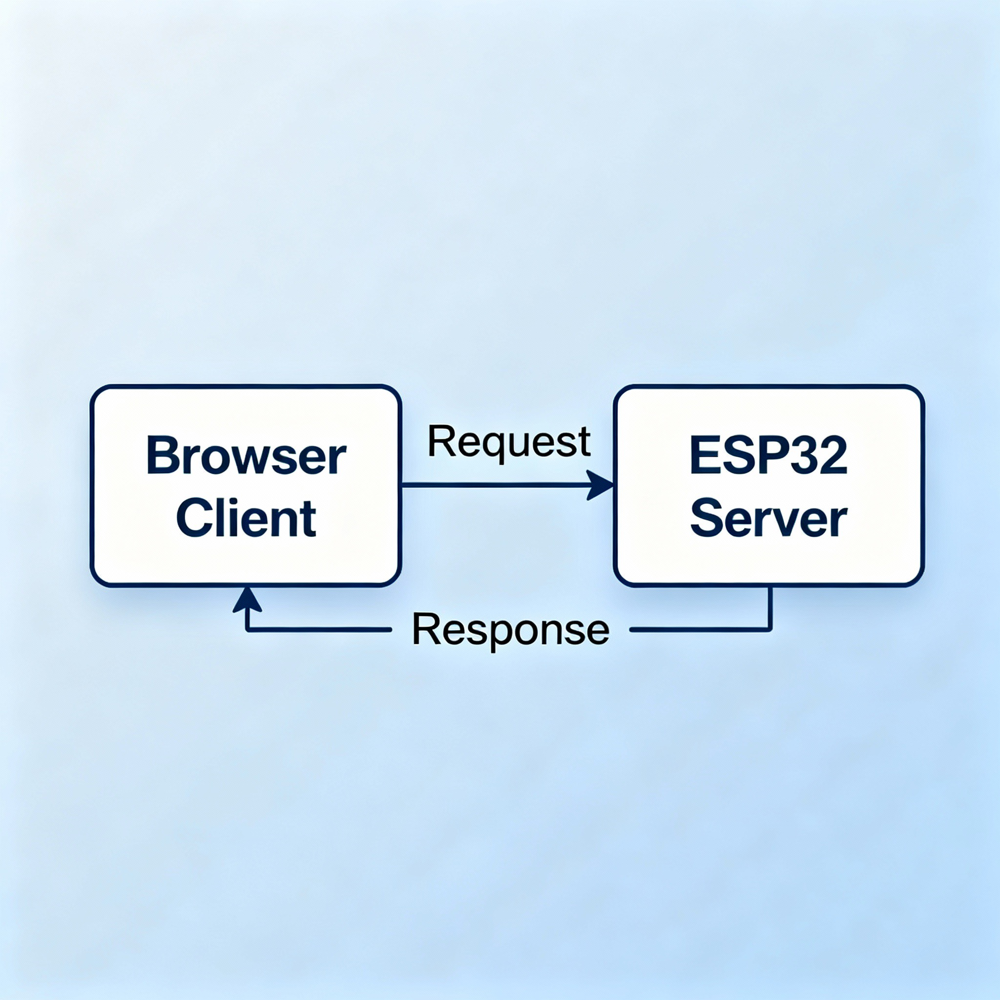

# The Client-Server Communication Model and HTTP

The client-server communication model is a foundational concept in networked computing, where a client (such as a web browser) requests services or resources from a server (such as a web server), and the server processes these requests and sends back a response.

## What Is the Client-Server Model?

In this model, tasks are divided between clients — devices or software that initiate communication — and servers — systems that provide specific resources or perform tasks upon request.
Servers can handle multiple clients at once, waiting for incoming requests and responding to each with the requested data or service.

### HTTP Request and Response: A Common Example

One of the most widely used examples of this model is HTTP (Hypertext Transfer Protocol), which underpins communication on the World Wide Web.
Here’s how a typical HTTP exchange works:
- The client (web browser) sends an HTTP request to the server, such as asking for the homepage of a website.
- The server receives this request, processes it (e.g., locating and preparing the webpage), and sends back an HTTP response containing the webpage data (HTML, CSS, images, etc.).
- The browser receives the response and renders the webpage for the user.



### Anatomy of HTTP Communication

- **HTTP Request**: Consists of a method (like GET or POST), a resource URL, headers, and sometimes a body (for sending data).
- **HTTP Response**: Contains a status code (like 200 OK), headers, and often a body with the requested data (such as an HTML file or JSON data). 

This back-and-forth pattern—client initiates a request, server returns a response—forms the core of most Internet-powered systems, including websites, email, and APIs.

Here are a few example HTTP requests and matching HTTP responses:

***

**Example 1: HTTP GET Request and Response**

Request:
```
GET /index.html HTTP/1.1
Host: www.example.com
User-Agent: Mozilla/5.0
Accept: text/html
```

Response:
```
HTTP/1.1 200 OK
Date: Mon, 27 Jul 2025 12:28:53 GMT
Server: Apache/2.4.41 (Unix)
Content-Type: text/html
Content-Length: 1024

<html>
  <head>
    <title>Example Page</title>
  </head>
  <body>
    <h1>Welcome to Example!</h1>
  </body>
</html>
```


***

**Example 2: HTTP POST Request and Response**

Request:
```
POST /users HTTP/1.1
Host: example.com
Content-Type: application/json
Content-Length: 49

{"name":"FirstName LastName","email":"bsmth@example.com"}
```

Response:
```
HTTP/1.1 201 Created
Content-Type: application/json
Location: http://example.com/users/123

{
  "message": "New user created",
  "user": {
    "id": 123,
    "firstName": "Example",
    "lastName": "Person",
    "email": "bsmth@example.com"
  }
}
```


***

**Example 3: HTTP Error Response (404 Not Found)**

Request (for a missing page):
```
GET /notfound.html HTTP/1.1
Host: www.example.com
```

Response:
```
HTTP/1.1 404 Not Found
Date: Sun, 18 Oct 2025 10:36:20 GMT
Server: Apache/2.4.41 (Unix)
Content-Type: text/html; charset=iso-8859-1
Content-Length: 230

<!DOCTYPE HTML>
<html>
  <head>
    <title>404 Not Found</title>
  </head>
  <body>
    <h1>Not Found</h1>
    <p>The requested URL was not found on this server.</p>
  </body>
</html>
```

### Key Features of the Client-Server Model

- Clear roles: Clients request, servers respond.
- Strict protocols (like HTTP) define how data is exchanged.
- Many clients can interact with one server at the same time.

The HTTP request and response model is essential for modern web applications, allowing diverse devices and software to communicate reliably and efficiently through standardized methods.

Web servers can be implemented on hardware as simple as an ESP32 microcontroller.
We may access them by knowing their IP addresses on the network.